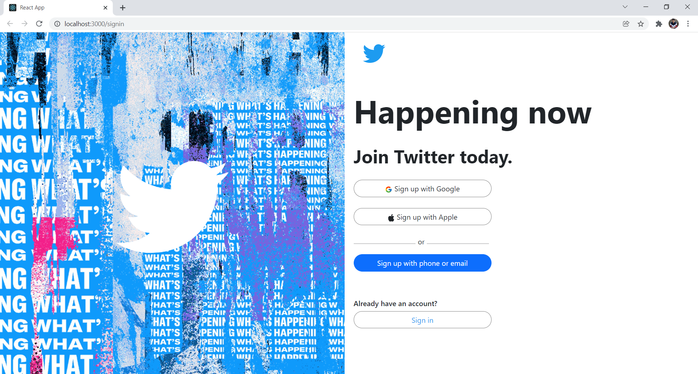
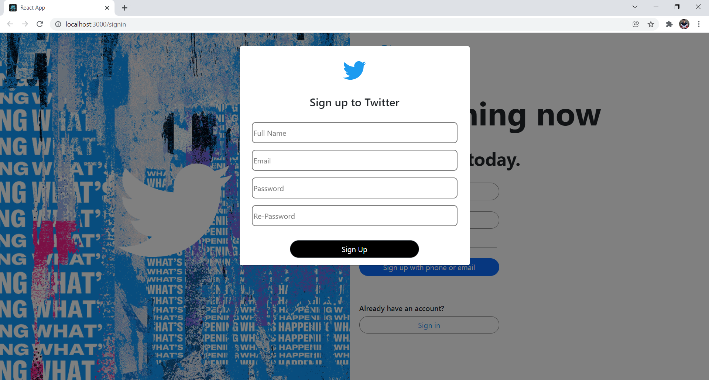
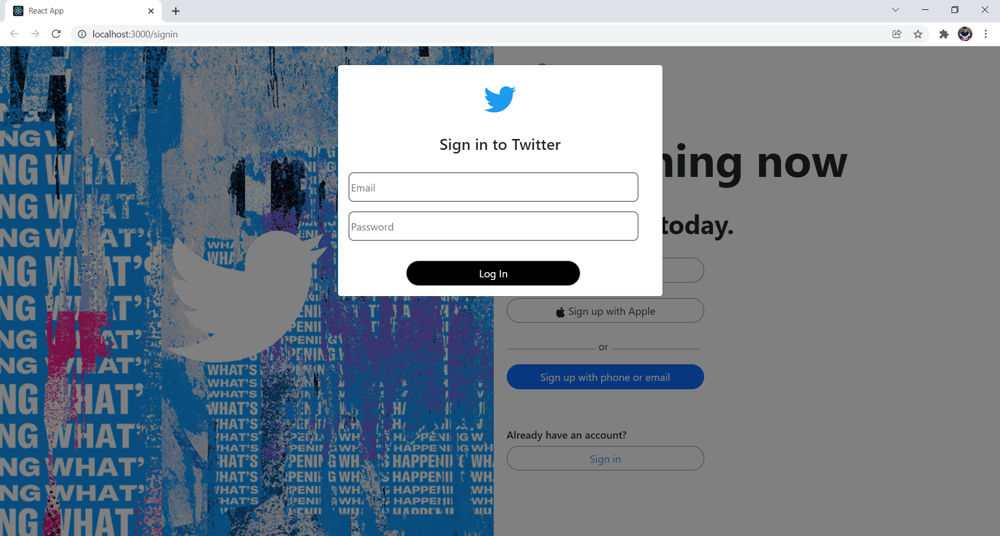
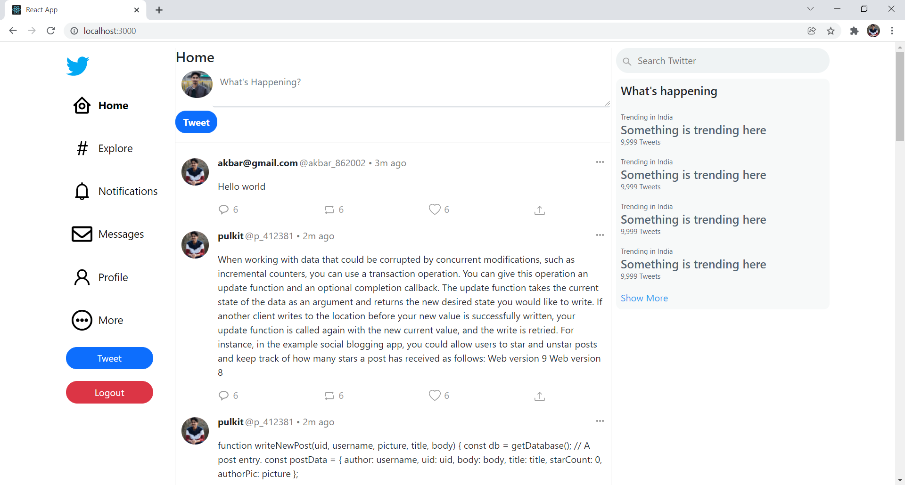
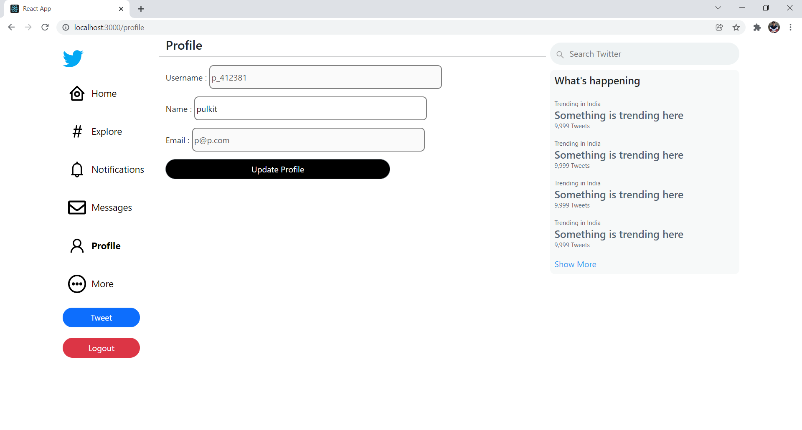

# Twitter Clone using REACTJS
Twitter clone build using ReactJS and Backend used is Google Firebase.

**Learned**
- Redux implementation
- Authorization using Firebase
- Login, Logout and LocalStorage with ReactJS.

**Stacks**
- ReactJS
- Redux
- Google Firebase (Backend)

**Database**
Firebase RealTime Database
- For storing tweets

**Extras**
- Implementation of redux

**What's Inside**
- ReactJS web app.
- Login SignUp with firebase authentication.
- Tweet functionality 
- LocalStorage for Storing user information like name,phone,username etc.

**Problems in this project**
Several points are there where modification and changes required. Kindly let me know if notice something.
Suggestions are welcome.
Kindly mail me at - dysu135@gmail.com